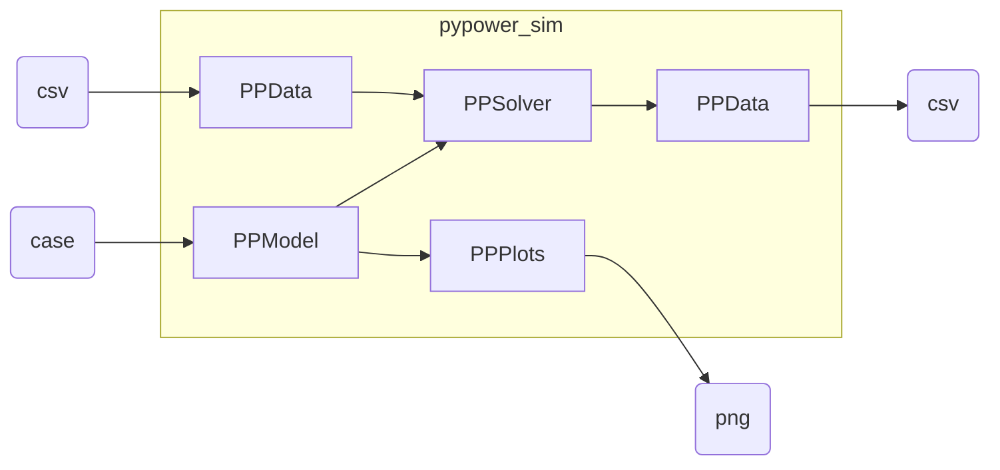

For full documentation see https://www.eudoxys.com/pypower_sim.

# pypower_sim

PyPOWER timeseries simulation

## Package architecture

## Installation

    python3 -m venv .venv
    . .venv/bin/activate
    pip install git+https://github.com/eudoxys.com/pypower_sim

## Examples

Preparation...

    cd examples
    python3

Loading the case...

    from pypower_sim import PPModel
    from wecc240 import wecc240

    model = PPModel(case=wecc240)

Run one-shot solvers...

    from pypower_sim import PPSolver

    solver=PPSolver(model)
    solver.solve_opf()
    solver.solve_opf(use_acopf=True)
    solver.solve_pf(with_result=True)

Plot bus voltages...

    from pypower_sim import PPPlots

    plotter = PPPlots(model)
    plotter.voltage().savefig("wecc240_voltage.png")

Load time-series inputs, outputs, and recorders...

    from pypower_sim import PPData
    tapes = PPData(test_model)

    tapes.set_input("bus","PD","load.csv",scale=10)
    tapes.set_input("bus","QD","load.csv",scale=1)
    tapes.set_output("bus","VM","wecc240_bus_vm.csv",formatting=".3f")

    tapes.set_output("bus","VA","wecc240_bus_va.csv",formatting=".4f")
    tapes.set_output("bus","PD","wecc240_bus_pd.csv",formatting=".4f")
    tapes.set_output("bus","QD","wecc240_bus_qd.csv",formatting=".4f")

    test_data.set_recorder("wecc240_cost.csv","cost",["cost"],
        scale=test_model.case['baseMVA'],formatting=".2f")

Run time-series solution

    start = dt.datetime(2020,7,31,17,0,0,0,pytz.UTC)
    end = dt.datetime(2020,8,1,16,0,0,0,pytz.UTC)
    solver.run_timeseries(
        start=start,
        end=end,
        freq="1h",
        )
